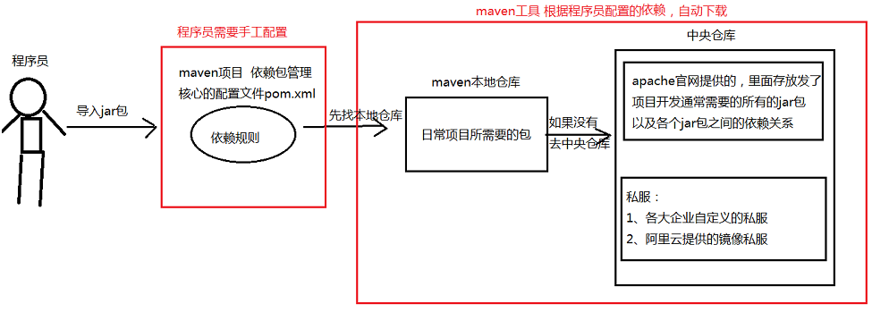

# project

- [ ] 传统MVC
- [ ] maven

## 传统MVC思想

### spring

> `applicationContext.xml`

* `IOC`：控制反转
* `AOP`：切面编程
* `DI`：依赖注入
* 包扫描
* 数据源配置
* 事务控制

### springMVC

> `springmvc-servlet.xml`

* `DispatcherServlet`
* `HandlerMapping`
* `HandlerAdepter`
* `ViewResolver`
* mvc注解扫描/包扫描
* 视图解析器

### mybatis

> `sqlMapConfig.xml`, `pojoMapper.xml`

* 半自动`ORM`
    * 自动结果集映射
    * 手动编写`sql`语句
* 驼峰映射
* 二级缓存
* 动态`sql`语句

## maven

### 设计模式



### pom

``` xml
<!-- 项目名称 -->
<groupId></groupId>

<!-- 单独项目名称 -->
<artifactId></artifactId>

<!-- 版本号 -->
<version></version>

<!-- 包类型 -->
<packaging></packaging>

<!-- maven地址 -->
<url></url>
```

### 阿里云镜像

``` xml
<mirror>
    <id>nexus-aliyun</id>
    <name>Nexus aliyun</name>
    <mirrorOf>*</mirrorOf>
    <url>http://maven.aliyun.com/nexus/content/groups/public</url>
</mirror>
```
