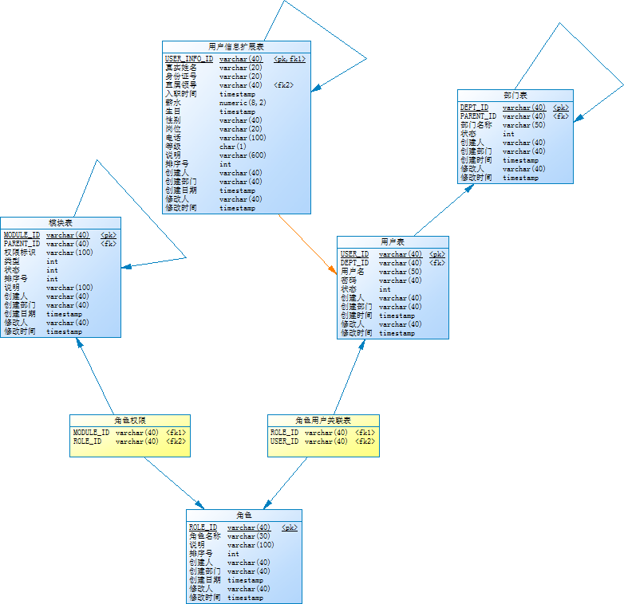

# project

- [ ] 详细分析项目原型
- [ ] powerdesigner
- [ ] RestFul

## 项目原型

### 数据关系



### dept_p

``` sql
CREATE TABLE `dept_p` (
  `DEPT_ID` varchar(40) NOT NULL,
  `PARENT_ID` varchar(40) DEFAULT NULL COMMENT '自关联，多对一',
  `DEPT_NAME` varchar(50) DEFAULT NULL,
  `STATE` int(11) DEFAULT NULL COMMENT '1启用0停用',
  `CREATE_BY` varchar(40) DEFAULT NULL,
  `CREATE_DEPT` varchar(40) DEFAULT NULL,
  `CREATE_TIME` timestamp NOT NULL DEFAULT CURRENT_TIMESTAMP ON UPDATE CURRENT_TIMESTAMP,
  `UPDATE_BY` varchar(40) DEFAULT NULL,
  `UPDATE_TIME` timestamp NOT NULL DEFAULT '0000-00-00 00:00:00',
  PRIMARY KEY (`DEPT_ID`)
) ENGINE=InnoDB DEFAULT CHARSET=utf8;
```

### module_p

``` sql
CREATE TABLE `module_p` (
  `MODULE_ID` varchar(40) NOT NULL,
  `PARENT_ID` varchar(40) DEFAULT NULL COMMENT '父模块ID',
  `NAME` varchar(100) DEFAULT NULL,
  `CTYPE` int(11) DEFAULT NULL COMMENT '1主菜单/2左侧菜单/3按钮',
  `STATE` int(11) DEFAULT NULL COMMENT '1启用0停用',
  `ORDER_NO` int(11) DEFAULT NULL,
  `REMARK` varchar(100) DEFAULT NULL,
  `CREATE_BY` varchar(40) DEFAULT NULL,
  `CREATE_DEPT` varchar(40) DEFAULT NULL,
  `CREATE_TIME` timestamp NOT NULL DEFAULT CURRENT_TIMESTAMP ON UPDATE CURRENT_TIMESTAMP,
  `UPDATE_BY` varchar(40) DEFAULT NULL,
  `UPDATE_TIME` timestamp NOT NULL DEFAULT '0000-00-00 00:00:00',
  PRIMARY KEY (`MODULE_ID`)
) ENGINE=InnoDB DEFAULT CHARSET=utf8;
```

### role_module_p

``` sql
CREATE TABLE `role_module_p` (
  `MODULE_ID` varchar(40) DEFAULT NULL,
  `ROLE_ID` varchar(40) DEFAULT NULL
) ENGINE=InnoDB DEFAULT CHARSET=utf8;
```

### role_p

``` sql
CREATE TABLE `role_p` (
  `ROLE_ID` varchar(40) NOT NULL,
  `NAME` varchar(30) DEFAULT NULL,
  `REMARKS` varchar(100) DEFAULT NULL,
  `ORDER_NO` int(11) DEFAULT NULL,
  `CREATE_BY` varchar(40) DEFAULT NULL,
  `CREATE_DEPT` varchar(40) DEFAULT NULL,
  `CREATE_TIME` timestamp NOT NULL DEFAULT CURRENT_TIMESTAMP ON UPDATE CURRENT_TIMESTAMP,
  `UPDATE_BY` varchar(40) DEFAULT NULL,
  `UPDATE_TIME` timestamp NOT NULL DEFAULT '0000-00-00 00:00:00',
  PRIMARY KEY (`ROLE_ID`)
) ENGINE=InnoDB DEFAULT CHARSET=utf8;
```

### role_user_p

``` sql
CREATE TABLE `role_user_p` (
  `ROLE_ID` varchar(40) DEFAULT NULL,
  `USER_ID` varchar(40) DEFAULT NULL
) ENGINE=InnoDB DEFAULT CHARSET=utf8;
```

### user_info_p

``` sql
CREATE TABLE `user_info_p` (
  `USER_INFO_ID` varchar(40) NOT NULL,
  `NAME` varchar(20) DEFAULT NULL,
  `CARD_NO` varchar(20) DEFAULT NULL,
  `MANAGER_ID` varchar(40) DEFAULT NULL,
  `JOIN_DATE` timestamp NOT NULL DEFAULT CURRENT_TIMESTAMP ON UPDATE CURRENT_TIMESTAMP,
  `SALARY` decimal(8,2) DEFAULT NULL,
  `BIRTHDAY` timestamp NOT NULL DEFAULT '0000-00-00 00:00:00',
  `GENDER` varchar(40) DEFAULT NULL,
  `STATION` varchar(20) DEFAULT NULL,
  `TELEPHONE` varchar(100) DEFAULT NULL,
  `USER_LEVEL` char(1) DEFAULT NULL COMMENT '4-普通用户 3-部门经理 2-副总 1-总经理 0-超级管理员',
  `REMARK` varchar(600) DEFAULT NULL,
  `ORDER_NO` int(11) DEFAULT NULL,
  `CREATE_BY` varchar(40) DEFAULT NULL COMMENT '登录人编号',
  `CREATE_DEPT` varchar(40) DEFAULT NULL COMMENT '登录人所属部门编号',
  `CREATE_TIME` timestamp NOT NULL DEFAULT '0000-00-00 00:00:00',
  `UPDATE_BY` varchar(40) DEFAULT NULL,
  `UPDATE_TIME` timestamp NOT NULL DEFAULT '0000-00-00 00:00:00',
  PRIMARY KEY (`USER_INFO_ID`)
) ENGINE=InnoDB DEFAULT CHARSET=utf8;
```

### user_p

``` sql
CREATE TABLE `user_p` (
  `USER_ID` varchar(40) NOT NULL,
  `DEPT_ID` varchar(40) DEFAULT NULL,
  `USERNAME` varchar(50) DEFAULT NULL,
  `PASSWORD` varchar(40) DEFAULT NULL,
  `STATE` int(11) DEFAULT NULL COMMENT '1启用0停用',
  `CREATE_BY` varchar(40) DEFAULT NULL,
  `CREATE_DEPT` varchar(40) DEFAULT NULL,
  `CREATE_TIME` timestamp NOT NULL DEFAULT CURRENT_TIMESTAMP ON UPDATE CURRENT_TIMESTAMP,
  `UPDATE_BY` varchar(40) DEFAULT NULL,
  `UPDATE_TIME` timestamp NOT NULL DEFAULT '0000-00-00 00:00:00',
  PRIMARY KEY (`USER_ID`)
) ENGINE=InnoDB DEFAULT CHARSET=utf8;
```

