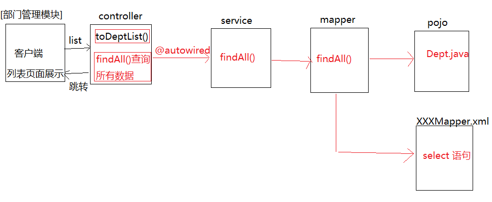
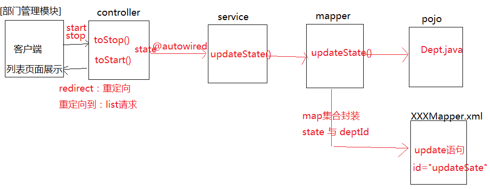

# project

- [ ] 部门管理

## 部门管理

### 查询部门的列表信息



### 状态的启停操作



### 批量启动和停用操作


### 具体实现

`DeptController.java`

``` java
package cn.tedu.ht.controller;

import cn.tedu.ht.pojo.Dept;
import cn.tedu.ht.service.DeptService;
import org.springframework.beans.factory.annotation.Autowired;
import org.springframework.stereotype.Controller;
import org.springframework.ui.Model;
import org.springframework.web.bind.annotation.RequestMapping;
import org.springframework.web.bind.annotation.RequestParam;

import java.util.List;

@Controller
public class DeptController {

    @Autowired
    private DeptService deptService;

//    // 列表页面的跳转
//    @RequestMapping(value = "/sysadmin/dept/list")
//    public String toDeptList() {
//        return "/sysadmin/dept/jDeptList";
//    }

    //根据实际的业务逻辑，在页面跳转时，先查询所有的列表信息
    @RequestMapping(value = "/sysadmin/dept/list")
    public String toDeptList(Model model) {
        List<Dept> deptList = deptService.findAll();
        model.addAttribute("deptList", deptList);
        return "/sysadmin/dept/jDeptList";
    }

    //部门状态的停用
    @RequestMapping(value = "/sysadmin/dept/stop")
    public String toStop(@RequestParam(value = "deptId", defaultValue = "0") String[] deptIds) {
        int state = 0;
        deptService.updateState(deptIds, state);
        return "redirect:/sysadmin/dept/list";
    }

    //部门状态的启动
    @RequestMapping(value = "/sysadmin/dept/start")
    public String toStart(@RequestParam(value = "deptId", defaultValue = "0") String[] deptIds) {
        int state = 1;
        deptService.updateState(deptIds, state);
        return "redirect:/sysadmin/dept/list";
    }

    //批量删除
    @RequestMapping(value = "/sysadmin/dept/delete")
    public String deleteDept(@RequestParam(value = "deptId", defaultValue = "0") String[] deptIds) {
        deptService.deleteDept(deptIds);
        return "redirect:/sysadmin/dept/list";
    }

    //点击新增按钮，实现页面跳转
    @RequestMapping(value = "/sysadmin/dept/tosave")
    public String toSaveDept(Model model) {
        List<Dept> parentDeptList = deptService.findParentDept();
        model.addAttribute("parentDeptList", parentDeptList);
        return "/sysadmin/dept/jDeptSave";
    }

    //新增页面的保存方法
    @SuppressWarnings("SpringMVCViewInspection")
    @RequestMapping(value = "/sysadmin/dept/save")
    public String saveDept(Dept dept, Model model) {
        String deptId = dept.getDeptId();
        if (deptId == null || "".equals(deptId))
            return "forward:/sysadmin/dept/tosave";
        Dept checkDept = deptService.findDeptById(deptId);
        if (checkDept != null) {
            model.addAttribute("errorInfo", "该部门编号已存在");
            return "forward:/sysadmin/dept/tosave";
        }
        deptService.saveDept(dept);
        return "redirect:/sysadmin/dept/list";
    }

    //点击修改按钮，实现页面的跳转
    @RequestMapping(value = "/sysadmin/dept/toupdate")
    public String toUpdateDept(String deptId, Model model) {
        Dept dept = deptService.findDeptBackById(deptId);
        List<Dept> parentDeptList = deptService.findParentDept();
        model.addAttribute("dept", dept);
        model.addAttribute("parentDeptList", parentDeptList);
        return "/sysadmin/dept/jDeptUpdate";
    }

    //点击更新页面，实现数据的更新
    @SuppressWarnings("SpringMVCViewInspection")
    @RequestMapping(value = "/sysadmin/dept/update")
    public String updateDept(Dept dept, Model model) {
        String deptId = dept.getDeptId();
        if (deptId == null || "".equals(deptId))
            return "forward:/sysadmin/dept/tosave";
        Dept checkDept = deptService.findDeptById(deptId);
        if (checkDept != null) {
            model.addAttribute("errorInfo", "该部门编号已存在");
            return "forward:/sysadmin/dept/tosave";
        }
        return "redirect:/sysadmin/dept/list";
    }


    // 查看
    @RequestMapping(value = "/sysadmin/dept/toview")
    public String toView() {

        return "/sysadmin/dept/jDeptView";
    }

}
```

`DeptMapper.java`

``` java
package cn.tedu.ht.mapper;

import cn.tedu.ht.pojo.Dept;
import org.apache.ibatis.annotations.Param;

import java.util.List;

public interface DeptMapper {

    List<Dept> findAll();

    // 使用注解对map集合进行封装
    void updateState(@Param(value = "deptIds") String[] deptIds,
                     @Param(value = "state") int state);

    void deleteDept(String[] deptIds);

    List<Dept> findParentDept();

    void saveDept(Dept dept);

    Dept findDeptById(String deptId);

    Dept findDeptBackById(String deptId);

}
```

`DeptService.java`

``` java
package cn.tedu.ht.service;

import cn.tedu.ht.pojo.Dept;

import java.util.List;

public interface DeptService {

    List<Dept> findAll();

    void updateState(String[] deptIds, int state);

    void deleteDept(String[] deptIds);

    List<Dept> findParentDept();

    void saveDept(Dept dept);

    Dept findDeptById(String deptId);

    Dept findDeptBackById(String deptId);

}
```

`DeptServiceImpl.java`

``` java
package cn.tedu.ht.service;

import cn.tedu.ht.mapper.DeptMapper;
import cn.tedu.ht.pojo.Dept;
import org.springframework.beans.factory.annotation.Autowired;
import org.springframework.stereotype.Service;

import java.util.List;

@Service
public class DeptServiceImpl implements DeptService {

    @Autowired
    private DeptMapper deptMapper;

    @Override
    public List<Dept> findAll() {
        return deptMapper.findAll();
    }

    @Override
    public void updateState(String[] deptIds, int state) {
        deptMapper.updateState(deptIds, state);
    }

    @Override
    public void deleteDept(String[] deptIds) {
        deptMapper.deleteDept(deptIds);
    }

    @Override
    public List<Dept> findParentDept() {
        return deptMapper.findParentDept();
    }

    @Override
    public void saveDept(Dept dept) {
        deptMapper.saveDept(dept);
    }

    @Override
    public Dept findDeptById(String deptId) {
        return deptMapper.findDeptById(deptId);
    }

    @Override
    public Dept findDeptBackById(String deptId) {
        return deptMapper.findDeptBackById(deptId);
    }

}
```

`DeptMapper.xml`

``` xml
<?xml version="1.0" encoding="UTF-8"?>
<!DOCTYPE mapper PUBLIC "-//mybatis.org//DTD Mapper 3.0//EN"
        "http://mybatis.org/dtd/mybatis-3-mapper.dtd">

<mapper namespace="cn.tedu.ht.mapper.DeptMapper">

    <!--手动封装结果集-->
    <resultMap id="deptRM" type="Dept" autoMapping="true">
        <id column="dept_id" property="deptId"/>
        <!--主表使用驼峰映射，其他字段不用写-->

        <!--上级部门：一个部门只有一个上级部门-->
        <association property="parentDept" javaType="Dept">
            <id column="p_id" property="deptId"/>
            <result column="p_name" property="deptName"/>
        </association>
    </resultMap>

    <!--公共的sql语句-->
    <sql id="selectDept">
        select *
        from dept_p d1
                 left join (select DEPT_ID p_id, DEPT_NAME p_name from dept_p)
                d2 on d1.PARENT_ID = d2.p_id
    </sql>


    <!--查询dept，自关联查询-->
    <select id="findAll" resultMap="deptRM" parameterType="long">
        select *
        from dept_p d1
                 left join (select DEPT_ID p_id, DEPT_NAME p_name from dept_p)
                d2 on d1.PARENT_ID = d2.p_id;
    </select>

    <!--更新部门状态-->
    <update id="updateState">
        <!--两个变量同事取值，使用map集合
        update dept_p
        set STATE = #{state}
        where DEPT_ID = #{deptId}-->

        <!--批量更新部门状态-->
        update dept_p set STATE = #{state} where DEPT_ID in
        <foreach collection="deptIds" open="(" close=")" item="deptId" separator=",">
            #{deptId}
        </foreach>
    </update>

    <!--批量删除部门信息-->
    <delete id="deleteDept">
        delete from dept_p where DEPT_ID in
        <foreach collection="array" open="(" close=")" item="deptId" separator=",">
            #{deptId}
        </foreach>
    </delete>

    <!--查询上级部门信息-->
    <select id="findParentDept" resultType="Dept">
        select *
        from dept_p
    </select>

    <!--动态插入一条部门信息-->
    <insert id="saveDept">
        insert into dept_p
        <trim prefix="(" suffix=")" suffixOverrides=",">
            <if test="deptId != null">dept_id,</if>
            <if test="parentDept != null">parent_id,</if>
            <if test="deptName != null">dept_name,</if>
            <if test="state != null">state,</if>
        </trim>
        values
        <trim prefix="(" suffix=")" suffixOverrides=",">
            <if test="deptId != null">#{deptId},</if>
            <if test="parentDept != null">#{parentDept.deptId},</if>
            <if test="deptName != null">#{deptName},</if>
            <if test="state != null">#{state}</if>
        </trim>
    </insert>

    <!--根据部门id查询数据库是否存在数据-->
    <select id="findDeptById" resultType="Dept">
        select *
        from dept_p
        where DEPT_ID = #{deptId}
    </select>

    <!--修改功能的数据回显-->
    <select id="findDeptBackById" resultMap="deptRM">
        <include refid="selectDept"/>where DEPT_ID=#{deptId}
    </select>

</mapper>
```
